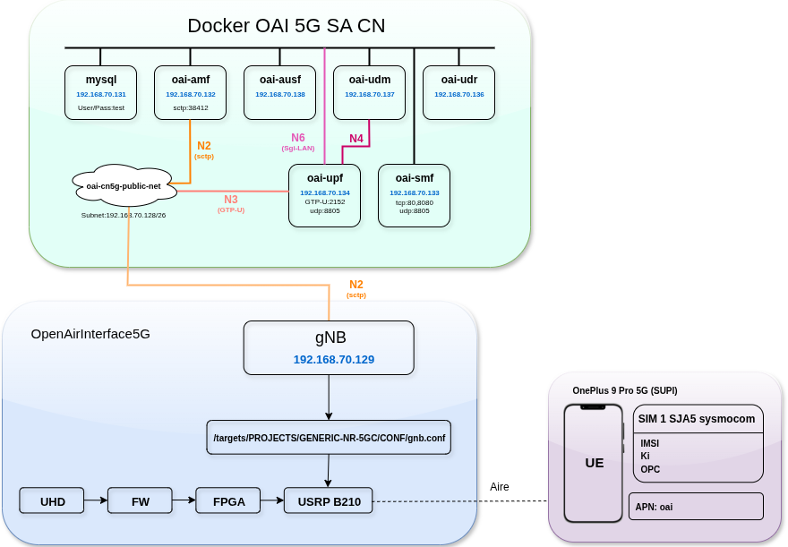
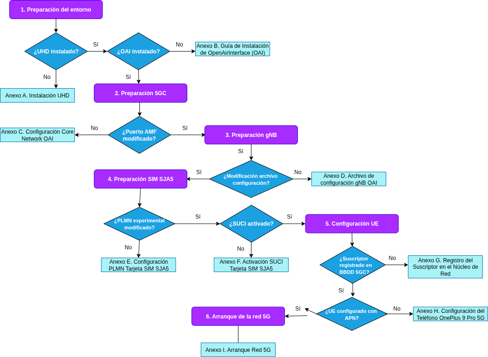

# 5G_configs
Este repositorio contiene los archivos de configuración de los proyectos relacionados con 5G, incluyendo la core network de OpenAirInterface, el proyecto OpenAirInterface5G y el proyecto de srsRAN.  
Es necesario acceder a la memoria del TFM e instalarse cada proyecto para después utilizar y utilizar los archivos de configuración recomendados.

## 1. Estructura del repositorio
```
5G_configs/
├── oai-cn5g/              # Archivos de configuración Core Network 5G con Docker Compose
├── openairinterface5g/    # Archivos de configuración de OpenAirInterface 5G
├── srsRAN_Project/        # Archivos de configuración de srsRAN
├── README.md              
```

---

### 1.1. oai-cn5g

Contiene la core network de 5G construida con OAI usando `docker-compose`.  

- **Objetivo:** Permitir desplegar un core network completo (AMF, SMF, UPF, UDM, UDR, AUSF, NRF) en contenedores Docker.  
- **Archivos clave:**
  - `docker-compose.yaml`: Define los servicios y sus configuraciones de red.  
  - `conf/config.yaml`: Configuración central de NFs, incluyendo PLMN (que en este caso será 00101), DNNs, slices y seguridad.  

- **Notas de configuración importantes:**
  - La PLMN configurada actualmente es `00101`.  

---

### 1.2. openairinterface5g

Implementación de OpenAirInterface 5G para simular el gNB.  

- **Objetivo:** Simular la estación base 5G conocida como gNB mediate USRP B210.
- **Archivos clave:**  
  - Scripts de configuración de gNB en la ruta `openairinterface5g/targets/PROJECTS/GENERIC-NR-5GC/CONF/`
  - Muy importante configurar la PLMN de pruebas deseada (en este proyecto es 00101) y la IP de la AMF del Core Network.
  - En este repositorio se encuentran distintos archivos de configuración utilizados para pruebas. Se recomienda utilizar `gnb.sa.band78.fr1.106PRB.usrpb210.conf`

---

### 1.3. srsRAN_Project

Proyecto basado en srsRAN, simular el gNB, 5GC, un servidor de métricas, grafana y la base de datos influxdb. 
Es más fácil de utilizar que openairinterface5g.
En este proyecto se ha utilizado OpenAirInterface pero también se ha desplegado srsRAN con los archivos de configuración de este repositorio.

---


### 2. Diseño del Entorno de Pruebas

#### 2.1 Arquitectura general
El despliegue de la red 5G mediante hardware SDR empleado en este proyecto se compone de tres elementos principales:

- **Núcleo de la Red 5G (5G SA CN)**: implementado con OpenAirInterface (OAI) y desplegado mediante `docker-compose`. El núcleo incluye las funciones AMF, SMF, UPF, UDM, UDR, AUSF y NRF, y proporciona la señalización y el plano de control necesarios para la operación 5G SA.
- **Estación base 5G (gNB)**: implementada sobre una **USRP B210** mediante OpenAirInterface RAN. El gNB se ejecuta de forma tradicional (compilación local) para permitir modificaciones en el código y pruebas con SDR.
- **Dispositivos de usuario (UE)**: terminales comerciales utilizados como clientes finales — en este estudio, un *OnePlus 9 Pro 5G* y un *Samsung Galaxy S25 Ultra* (con SIMs programadas cuando procede).



**Figura 1.** Diagrama del entorno de pruebas 5G: core (OAI CN5G), gNB sobre USRP B210 y UEs (OnePlus / Samsung). Las IPs y interfaces principales (N2, N3, N4, N6) se muestran para referencia.


En la Figura 1 se muestra el diagrama de alto nivel de la arquitectura de despliegue del entorno de pruebas, indicando las direcciones IP usadas por cada función y las interfaces N2/N3/N4/N6 que interconectan los elementos. A continuación se detallan los componentes y los requisitos para su funcionamiento.

#### 2.1.1 OpenAirInterface (OAI)
**OpenAirInterface5G** es un proyecto open-source que implementa tanto RAN (gNB) como Core 5G (5GC). En este proyecto OAI se utiliza para desplegar:

1. El núcleo de red 5G (5GC) con sus funciones de red (AMF, SMF, UPF, UDM, UDR, AUSF, NRF).
2. El gNB, que atiende la conexión de los dispositivos de usuario (UE).

**Entorno seleccionado:** se utiliza la opción *5GC básico* desplegada mediante **Docker-Compose**, lo que ofrece un equilibrio entre funcionalidad de red y facilidad de despliegue en laboratorio. La configuración detallada de los NFs (IPs, DNNs, S-NSSAI, etc.) se documenta en el `conf/config.yaml` del proyecto `oai-cn5g` y los ficheros `docker-compose.yaml`.

#### 2.1.2 gNB (OpenAirInterface)
La estación base (gNodeB) se ha implementado usando el binario `nr-softmodem` de OpenAirInterface y se conecta al core mediante la red `oai-cn5g-public-net`. En este trabajo se ejecutó el gNB sobre la **USRP B210** en **banda n78**, con configuración de 106 PRBs y SCS = 30 kHz (archivo de config: `openairinterface5g/targets/PROJECTS/GENERIC-NR-5GC/CONF/gnb.sa.band78.fr1.106PRB.usrpb210.conf`). La ejecución se realiza en modo Standalone (SA) y con las opciones necesarias para pruebas.

#### 2.1.3 Dispositivo de Usuario (UE)
Los UEs son los puntos finales que validan conectividad y rendimiento:

- **OnePlus 9 Pro 5G** — con SIM programada SJA5 (PLMN `00101`) y SUCI habilitado según la experimentación.
- **Samsung Galaxy S25 Ultra** — con SIM comercial (Yoigo) para pruebas comparativas.

**Requisitos de los UEs:**
- Compatibilidad 5G SA y firmware actualizado.
- SIM con parámetros correctos (IMSI/PLMN/K/OPc o SUCI activado) registrados en la base de datos del 5GC.

#### 2.1.4 Tarjeta SIM programable (SJA5 / Sysmocom)
Las tarjetas SJA5 permiten programar IMSI, K, OPc y activar SUCI. Estos parámetros deben registrarse en la base de datos `oai_db` del núcleo para que el usuario pueda autenticarse mediante 5G-AKA y/o SUCI.

---


# 3.Instalación del gNB y Core Network 5G

## Instalación del gNB
Para instalar el **gNB**, clonamos el repositorio:

```bash
git clone -b develop https://gitlab.eurecom.fr/oai/OpenAirInterface5G.git
cd OpenAirInterface5G/
```
Compilamos el proyecto.
En este caso, al utilizar un USRP B210, ejecutamos el siguiente comando:
```bash
sudo ./build_oai -I -w USRP --UE --eNB --gNB --nrUE -w SIMU
```

## Descarga del CoreNetwork

Descargamos y descomprimimos el Core Network 5G:

```bash
wget -O ~/oai-cn5g.zip https://gitlab.eurecom.fr/oai/OpenAirInterface5G/-/archive/develop/OpenAirInterface5G-develop.zip?path=doc/tutorial_resources/oai-cn5g
unzip ~/oai-cn5g.zip
mv ~/OpenAirInterface5G-develop-doc-tutorial_resources-oai-cn5g/doc/tutorial_resources/oai-cn5g ~/oai-cn5g
rm -r ~/OpenAirInterface5G-develop-doc-tutorial_resources-oai-cn5g ~/oai-cn5g.zip
```
Compilamos el proyecto.
En este caso, al utilizar un USRP B210, ejecutamos el siguiente comando:
```bash
sudo ./build_oai -I -w USRP --UE --eNB --gNB --nrUE -w SIMU
```

## 4. Cómo desplegar

### Flujo de despliegue de la red 5G

A continuación, se muestra el flujo de despliegue seguido para la puesta en marcha de la red 5G experimental, desde el arranque de la core network hasta la conexión de los dispositivos de usuario:



**Figura 2.** Flujo de despliegue de la red 5G.

Hay que seguir los siguientes pasos:
1. Arranque del núcleo 5G (OAI CN5G) mediante `docker-compose`.  
2. Ejecución del gNB con USRP B210 mediante `nr-softmodem`.  
3. Conexión de los dispositivos de usuario (UE) con sus tarjetas SIM programadas. 

A continuación, especificaremos los comandos de despliegue de la red 5G.
Los Anexos se pueden consultar en el TFM correspondiente, que deberá ser solicitado en caso de querer consultarlo, ya que no está permitida su publicación abierta. 

### 4.1. Desplegar el core network OAI
Recordar que para desplegar el core network hay que instalarselo del repositorio

```bash
cd oai-cn5g
docker-compose up -d
```
Esto levantará todos los contenedores: AMF, SMF, UPF, UDM, UDR, AUSF, NRF e IMS.

Para detener los contenedores:
```bash
docker-compose down
```

### 4.1. Desplegar el gNB con OpenAirInterface 5G

```bash
cd ~/GitHub/5G/openairinterface5g/cmake_targets
./build_oai -I --gNB --nrUE
```


Lanzar la red:

```bash
cd ~/GitHub/5G/openairinterface5g/cmake_targets/ran_build/build

sudo ./nr-softmodem \
  -O ../../../targets/PROJECTS/GENERIC-NR-5GC/CONF/gnb.sa.band78.fr1.106PRB.usrpb210.conf \
  --sa \
  -E \
  --continuous-tx

```

